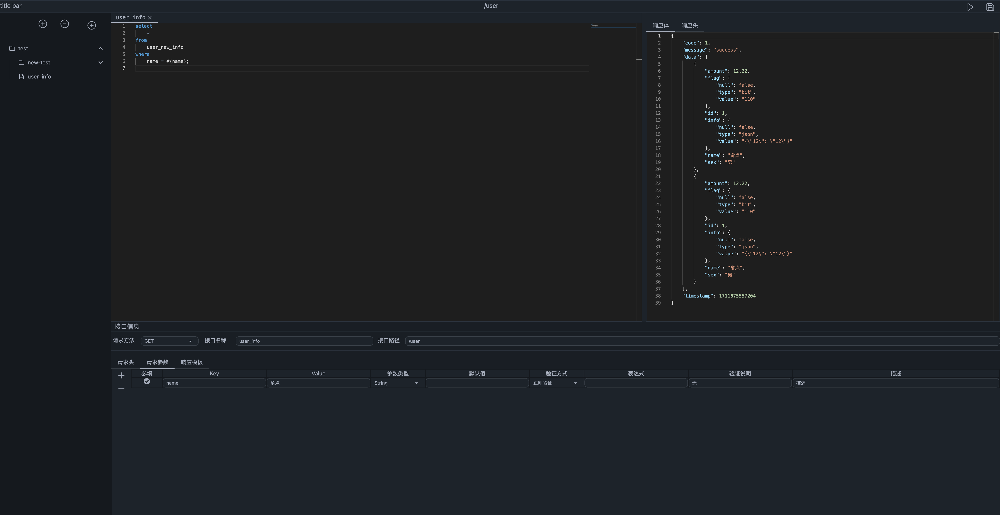

# A WebAssembly Front-End Project For Magic-Api



## Technology Stack

- **Yew:** A Rust framework for building frontend web apps with WebAssembly.
- **TailwindCSS:** A highly customizable CSS framework for quickly building
  designs.
- **DaisyUI:** A component library built on top of TailwindCSS, enhancing UI
  development efficiency.
- **Magic API:** Serves as the backend, allowing for the quick creation of
  backend interfaces through SQL.

## Features

This project is a frontend application that offers the following features:

- **Interface Generation:** Users can quickly add backend interfaces by writing
  SQL queries.
- **User-Friendly Interface:** Utilizes components from TailwindCSS and DaisyUI
  to provide an intuitive and responsive user experience.

## Getting Started

clone this repository

```sh
cd /path/to/codeless-front
trunk serve
```

and you also need to run tailwindcss client

```sh
./tailwindcss.sh
```
